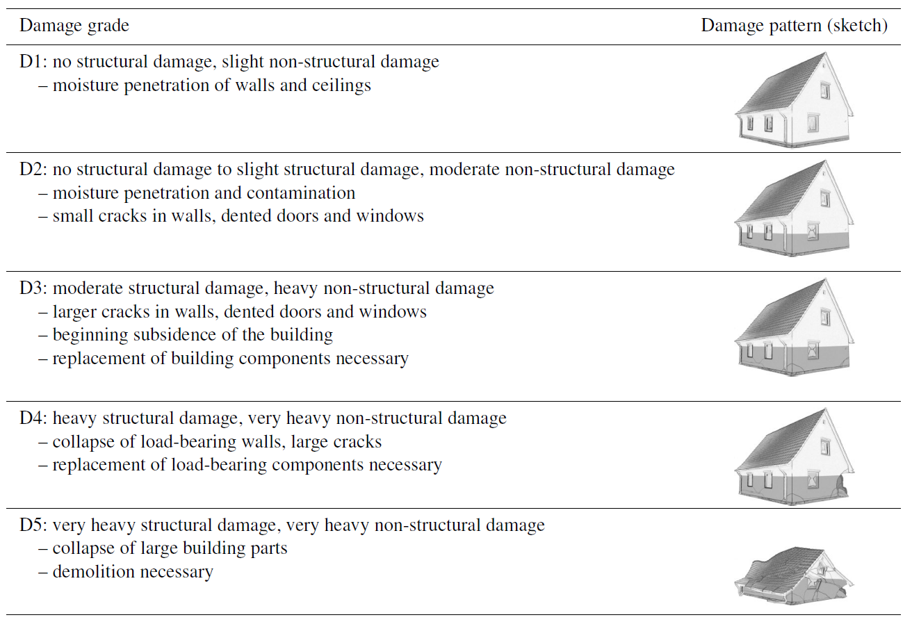
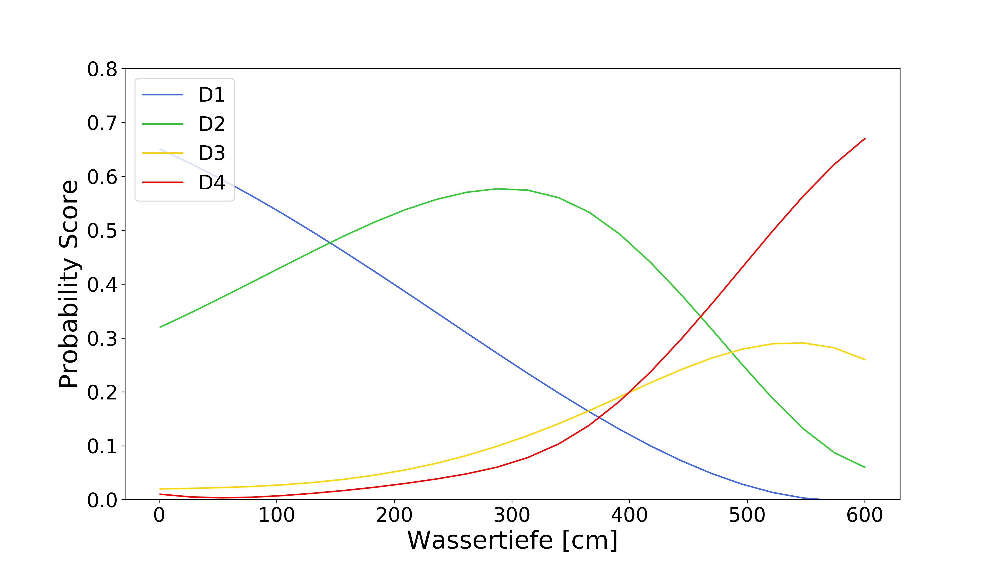
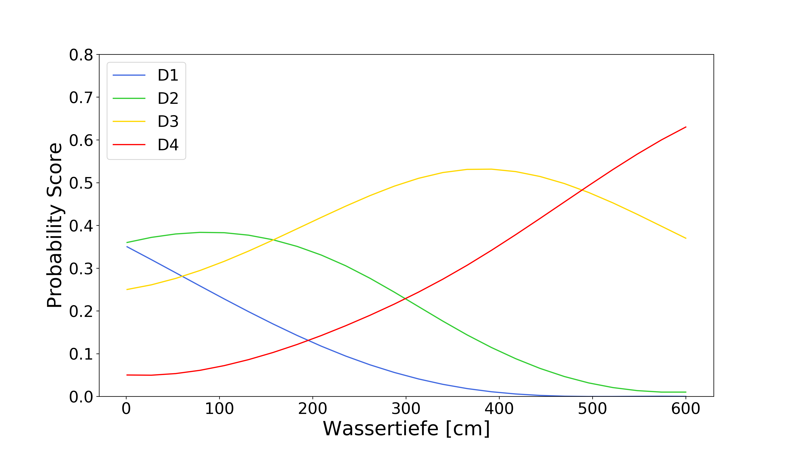

# RiesgosFloodDamage
Public repository for script development related to the RIESGOS project


Disclaimer: The current version of the damage model is not validated for the region of application, since no empirical damage data from the region is available. Decision functions are based on data from Germany and scientific literature, implemented as Naive Bayes algorithm in Python. The output is a probability score for ordinal classes of structural building damage, as opposed to typical flood loss models which output relative monetary loss. It can be considered a technical demonstration in line with the central aim of the RIESGOS project: setting up a chain of models as coupled web-serivces to study complex cascading natural hazard events </div>


**Definition of damage states for floods**  
Engineers have classified the typical observed patterns of damages to buildings in various ways. A well-established definition in accordance with the EMS-98 scheme can be found in Schwarz & Maiwald (2007). The Section of Hydrology at GFZ Potsdam has collected empirical damage data from various flood events, following this scheme (e.g. Laudan et al. 2017). For the model provided here, the classes 2 ('small cracks') and 3 ('big cracks') have been merged, since they could not be distinguished in statistical analysis.

<p align="center">
  
  <br>
  <i>Definition by Schwarz & Maiwald 2007, english version taken from Laudan et al. 2017</i>
</p>


**Decision function**  
The model can be considered a probabilistic, multi-variable damage classification. A probability score is computed by a Gaussian Naive Bayes algorithm, using 4 variables: 
1. *water depth* is the standard variable for nearly all operational flood damage models
2. *flow velocity* in combination with water depth reflects the dynamic pressure acting on a structure. The product of both is called intensity. According to literature, a value between 1.5 and 3 m²/s causes first structural damages, and a value > 7 m²/s may lead to total collapse of a building. However, real field observations indicate that no such fix thresholds exist, and probabilistic models are necessary to capture the actual dynamics and associated uncertainty in prediction. (further reading: Kreibich et al. 2009)
3. *duration of inundation* may lead to severe structural damage, even total collapse, below the abovementioned intensity thresholds. This has especially been observed for rammed earth constructions, where load-bearing walls lose stability from lasting moisture
4. *building footprint area* is anti-correlated with relative monetary loss (due to the buildings value) and to a lesser extent also with structural damages. A potential explanation for this effect might be the overall quality, material and mode of construction of larger buildings.

<p align="center">
   
  <br>
  <i>Example of model behaviour for (left) velocity 1 m/s and duration 6 h (right) velocity 0.5 m/s and duration 72 h</i>
</p>

**Literature**  
**Kreibich, H.**; Piroth, K.; Seifert, I.; Maiwald, H.; Kunert, U.; Schwarz, J.; Merz, B. & Thieken, A. H.: Is flow velocity a significant parameter in flood damage modelling? Natural Hazards and Earth System Science, Copernicus GmbH, 2009, 9, 1679-1692.  
**Laudan, J.**; Rözer, V.; Sieg, T.; Vogel, K. & Thieken, A. H. Damage assessment in Braunsbach 2016: data collection and analysis for an improved understanding of damaging processes during flash floods Natural Hazards and Earth System Sciences, Copernicus GmbH, 2017, 17, 2163-2179  
**Schwarz, J. and Maiwald, H.**: Prognose der Bauwerksschädigung unter Hochwassereinwirkung, Bautechnik, 84, 450–464, 2007 (in German).

## Requirements

You can run the script using a virtual environment installed with the following
steps:

```shell
python3 -m venv venv-flooddamage
source venv-flooddamage/bin/activate
pip3 install wheel
pip3 install GDAL==$(gdal-config --version)
pip3 install -r requirements.txt
```

Otherwise it is also possible to us a docker image for running the script:

```shell
docker build -f metadata/Dockerfile . --tag flooddamage
docker run -it flooddamage /bin/bash
# python3 showcase_ecuador/showcase_exe.py
```
